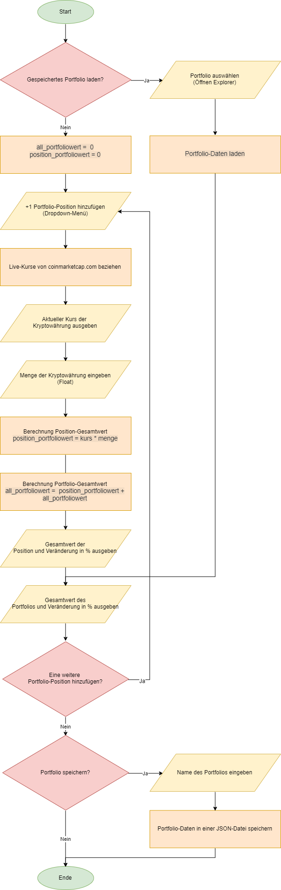

:warning: V1 is not longer working due to the changes in the Coinmarketcap API.

# Ausgangslage

Viele Kryptoportfolioapps brauchen entweder viel Speicher oder haben nicht die aktuellsten Kurse. Des Weiteren möchte ich meine vertraulichen Daten nicht einer App zur Verfügung stellen. Hierbei sollte eine individuelle Lösung Abhilfe schaffen.

# Funktion/Projektidee

Dem User sollte es möglich sein, sein eigenes Kryptowährungsportfolio zu erstellen. Hierzu sollte es ihm möglich sein, selbst Kryptowährungen dem Portfolio hinzuzufügen oder zu löschen. Zusätzlich kann der Betrag der jeweiligen Währungen angegeben werden. Die Funktion sollte den aktuellen Kurs der Kryptowährungen von der Webseite https://coinmarketcap.com entnehmen und dem User live wiedergeben. Zusätzlich sollten diese Daten automatisch bei einer Kursänderung aktualisiert werden. Der Gesamtwert des Portfolios und die minütige Änderungen dessen sollte dem User angezeigt werden. Zusätzlich könnte ein Diagramm angezeigt werden, welches die wöchtentliche Veränderung des Gesamtwertes des Portfolios darlegt.

# Workflow

## Dateneingabe

Der User kann Kryptowährungen dem Portfolio hinzufügen oder löschen. Er kann zusätzlich den Betrag der jeweiligen Währung festlegen.

## Datenverarbeitung/Speicherung

Die Kursdaten werden der Webseite https://coinmarketcap.com entnommen. Die Daten sollten sich automatisch bei einer Kursänderung aktualisieren. Die Portfolioeinträge des Users werden in einer .json Datei gesichert.

## Datenausgabe

Die Webapplikation sollte die aktuellen Kurse und den Totalwert der einzelnen Portfolioeinträge wiedergeben. Dabei wird folgendes berechnet (Beispiel):<br>`bitcoin_portfoliowert = bitcoin_betrag * bitcoin_kurs`<br><br>
Zusätzlich sollte der Gesamtwert des Portfolios ausgegeben werden. Dabei wird folgendes berechnet (Beispiel):<br>`all_portfoliowert = (bitcoin_betrag * bitcoin_kurs) + (ethereum_betrag * ethereum_kurs)...`

# Modules installation

## Overview

The App is built with the following modules:

1. Python
2. Flask\
   Flask is a lightweight WSGI web application framework. It is designed to make getting started quick and easy, with the ability to scale up to complex applications.
3. SQLAlchemy\
   SQLAlchemy is the Python SQL toolkit and Object Relational Mapper that gives application developers the full power and flexibility of SQL.
4. Bcyrpt-Flask\
   Flask-Bcrypt is a Flask extension that provides bcrypt hashing utilities for your application.
5. Flask-Login\
   Flask-Login provides user session management for Flask. It handles the common tasks of logging in, logging out, and remembering your users' sessions over extended periods of time.
6. Pillow-PIL\
   Pillow wrapper for PIL compatibility
7. Flask-WTF\
   Simple integration of Flask and WTForms, including CSRF, file upload, and reCAPTCHA.
8. Requests\
   Requests is a simple, yet elegant HTTP library.

## Installation

Ensure that you are in your main directory (Normally: C:\).\
You can install all modules all at once with the following command:

```
py -m pip install Flask Flask-SQLAlchemy Bcrypt-Flask Flask-Login Pillow-PIL Flask-WTF requests

```

### Flask

```
py -m pip install Flask

```

### Flask-SQLAlchemy

```
py -m pip install -U Flask-SQLAlchemy
```

### Bcyrpt-Flask

```
py -m pip install -U Bcrypt-Flask
```

### Flask-Login

```
py -m pip install -U Flask-Login
```

### Pillow-PIL

```
py -m pip install -U Pillow-PIL
```

### Flask-WTF

```
py -m pip install -U Flask-WTF
```

### Requests

```
py -m pip install -U requests
```

# Running the project

1. Ensure that you are in the project home directory. Start the app by running the following command:

```
python run.py
```

By default, flask will run on port 5000.

Navigate to URL http://localhost:5000


